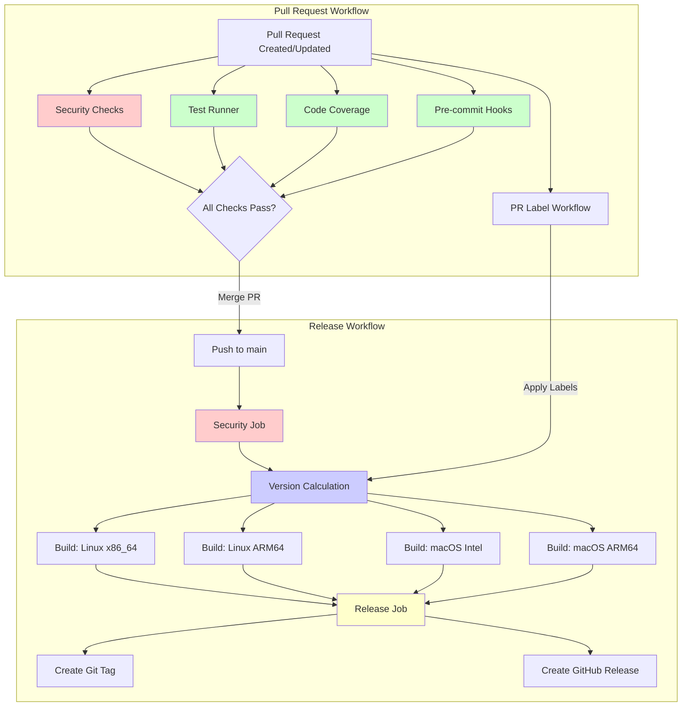

# Phase 7: Continuous Delivery Implementation Plan

## Overview
Automate the release process so that each push to the `main` branch creates a new GitHub release with compiled binaries for multiple platforms.

## Goals
- Integrate security checks into pull request workflow
- Integrate test runner (cargo-nextest) into pull request workflow with JUnit XML output
- Integrate code coverage into pull request workflow
- Integrate pre-commit hooks into pull request workflow
- Create PR label workflow to automatically apply version labels based on Conventional Commits
- Automate release creation on pushes to `main`
- Build binaries for multiple platforms (Linux x86_64/ARM64, macOS Intel/Apple Silicon)
- Calculate version from PR labels (labels created in Phase 6, applied by PR label workflow)
- Generate release notes automatically
- Include binary checksums for verification
- Integrate security checks into release process

## Workflow Architecture

The following diagram shows the workflow dependencies and job relationships:

**Legend:**
- **Red**: Security checks (blocking)
- **Green**: Quality checks (blocking)
- **Blue**: Version calculation
- **Yellow**: Release creation

## Prerequisites
- [ ] Phase 1 (Security) completed
- [ ] Phase 2 (Test Runner) completed or in progress (for PR workflow integration)
- [ ] Phase 4 (Coverage) completed or in progress
- [ ] Phase 5 (Pre-commit Hooks) completed or in progress (for PR workflow integration)
- [ ] Phase 6 (GitHub Configuration) completed (version labels created in GitHub UI)
- [ ] GitHub repository access (admin or owner permissions)
- [ ] Note: CI/CD workflows will be created in this phase

### Workflow Permissions Note

**Important**: When workflows are first created, GitHub Actions may require explicit permission grants for certain operations:

1. **First Workflow Run**:
   - GitHub may prompt you to approve workflow permissions
   - Navigate to the Actions tab and approve permissions if prompted
   - Some workflows may fail on first run until permissions are approved

2. **Required Permissions**:
   - **PR Label Workflow**: Requires `pull-requests: write` permission
   - **Release Workflow**: Requires `contents: write` permission (for creating releases and tags)
   - **Version Calculation**: Requires `pull-requests: read` permission (to read PR labels)

3. **Setting Permissions**:
   - Permissions are configured in workflow files (see Section 5 and Section 8)
   - Repository-level permissions are configured in Settings → Actions → General → Workflow permissions
   - Ensure "Read and write permissions" is selected (see Phase 6, Section 4)

4. **Troubleshooting Permission Errors**:
   - If workflows fail with permission errors, check:
     - Workflow file `permissions` section is correct
     - Repository Settings → Actions → General → Workflow permissions
     - First-time approval may be required in Actions tab
   - Common error: `Resource not accessible by integration` - usually means permissions need approval

5. **Testing Permissions**:
   - Create a test PR to verify PR label workflow has correct permissions
   - Push a test commit to `main` to verify release workflow has correct permissions
   - Check Actions tab for any permission approval prompts

## Implementation Subplans

This phase is split into three subplans, one for each workflow:

1. **[Pull Request Workflow](./07_01_Pull_Request_Workflow.md)** - Integrates security checks, test runner, code coverage, and pre-commit hooks into PR workflow
2. **[PR Label Workflow](./07_02_PR_Label_Workflow.md)** - Automatically applies version labels to PRs based on Conventional Commits
3. **[Release Workflow](./07_03_Release_Workflow.md)** - Automates release creation with multi-platform binary builds

## Implementation Order

The recommended implementation order is:

1. **Pull Request Workflow** (Phase 7.1) - Ensures code quality before merging
2. **PR Label Workflow** (Phase 7.2) - Must be completed before Release Workflow (needed for version calculation)
3. **Release Workflow** (Phase 7.3) - Depends on PR Label Workflow for version calculation

## Quick Reference

### Pull Request Workflow
- **File**: `.github/workflows/pull_request.yaml`
- **Trigger**: Pull requests (opened, synchronize, reopened)
- **Jobs**: Security, Test, Coverage, Pre-commit
- **See**: [07_01_Pull_Request_Workflow.md](./07_01_Pull_Request_Workflow.md)

### PR Label Workflow
- **File**: `.github/workflows/pr-label.yml`
- **Trigger**: Pull requests (opened, synchronize, reopened)
- **Jobs**: Label (analyzes commits and applies version labels)
- **See**: [07_02_PR_Label_Workflow.md](./07_02_PR_Label_Workflow.md)

### Release Workflow
- **File**: `.github/workflows/release.yaml`
- **Trigger**: Push to `main` branch
- **Jobs**: Security, Version, Build-and-release (matrix), Release
- **See**: [07_03_Release_Workflow.md](./07_03_Release_Workflow.md)

## Implementation Tasks

### Phase 7.1: Pull Request Workflow

See [07_01_Pull_Request_Workflow.md](./07_01_Pull_Request_Workflow.md) for detailed implementation tasks.

**Summary**:
- [x] Integrate security checks into PR workflow (blocking)
- [x] Integrate test runner (cargo-nextest) with JUnit XML output
- [x] Integrate code coverage with threshold enforcement
- [x] Integrate pre-commit hooks

### Phase 7.2: PR Label Workflow

See [07_02_PR_Label_Workflow.md](./07_02_PR_Label_Workflow.md) for detailed implementation tasks.

**Summary**:
- [x] Create PR label workflow file
- [x] Implement commit analysis and label application logic
- [ ] Test workflow with various commit types

### Phase 7.3: Release Workflow

See [07_03_Release_Workflow.md](./07_03_Release_Workflow.md) for detailed implementation tasks.

**Summary**:
- [x] Create release workflow file
- [x] Add security job (blocking)
- [x] Add version calculation job (reads PR labels)
- [x] Add multi-platform build job
- [x] Add release job (creates GitHub release)

## Success Criteria

- [x] Security checks integrated into PR workflow (blocking)
- [x] Test runner (cargo-nextest) integrated into PR workflow with JUnit XML output
- [x] Test results uploaded as artifacts in PR workflow
- [x] Code coverage integrated into PR workflow (blocking)
- [x] Coverage thresholds enforced in CI (Line > 80%, Branch > 70%, Function > 85%)
- [x] Pre-commit hooks integrated into PR workflow
- [ ] Pre-commit job runs in CI and passes (needs testing)
- [x] PR label workflow created (`.github/workflows/pr-label.yml`)
- [x] PR label workflow automatically applies version labels
- [ ] PR label workflow tested and working (needs testing)
- [x] Security checks integrated into release workflow (blocking)
- [x] Release workflow created (`.github/workflows/release.yaml`)
- [x] Security checks run before builds (blocking)
- [x] Version is calculated from PR labels
- [x] Binaries are built for all target platforms
- [x] Release is created automatically on push to `main`
- [x] Release includes binaries and checksums
- [x] Release notes are generated automatically
- [x] Git tag is created with version
- [x] Cargo.toml version is updated
- [ ] Workflow tested and working (needs testing)
- [ ] Documentation updated

## Release Platforms

The release workflow builds binaries for the following platforms:
- Linux x86_64 (`x86_64-unknown-linux-gnu`) → `move_maker-linux-x86_64`
- Linux ARM64 (`aarch64-unknown-linux-gnu`) → `move_maker-linux-aarch64`
- macOS Intel (`x86_64-apple-darwin`) → `move_maker-macos-x86_64`
- macOS Apple Silicon (`aarch64-apple-darwin`) → `move_maker-macos-aarch64`

**Binary Name**: The compiled binary is named `move_maker` (matching the Cargo package name).

## Version Calculation

Version is calculated from PR labels (from Phase 6):
- `version: major` or `breaking` → MAJOR bump
- `version: minor` or `feature` → MINOR bump
- No label → PATCH bump (by commit count since last tag)

**Patch Version Details**: When no version label is present, the patch version is incremented by the number of commits since the last tag. For example, if the last tag was `v1.0.0` and there are 3 commits since then, the new version will be `v1.0.3`.

**Multiple PRs**: If multiple PRs are merged in a single push to `main`, the version calculation checks all merged PRs since the last tag and uses the highest priority label found (major > minor > patch). If any PR has a major label, the version is bumped major regardless of other labels.

**Note**: The PR Label Workflow (Phase 7.2) applies both the primary labels (`version: major`, `version: minor`) and alternative labels (`breaking`, `feature`) to ensure compatibility with the version calculation logic.

**First Release**: On the first push to `main` (when no tags exist), the workflow uses the version from `Cargo.toml` as the base version. This creates the first release and tag, which subsequent releases will use as a reference point.

See REQ_VERSIONING.md for detailed versioning strategy.

## Notes

- All releases are triggered automatically on pushes to `main`
- **Direct commits to `main` are prohibited** (enforced by branch protection rules configured in Phase 6)
- All security tools are **blocking** in CI/CD workflows
- Security checks must pass before builds or releases proceed
- Security checks run in both PR and release workflows
- Version is calculated from PR labels applied by PR label workflow
- **Multiple PRs**: When multiple PRs are merged in a single push, the version calculation checks all merged PRs since the last tag and uses the highest priority label (major > minor > patch)
- **First release**: Uses version from `Cargo.toml` when no tags exist, creating the first tag for subsequent releases
- **Version calculation failure**: If version calculation fails, the workflow aborts and no release is created
- Binaries are built with embedded dependency info (cargo-auditable)
- Release binaries are audited after build
- Checksums are generated for all binaries
- **Workflow coordination**: The PR Label Workflow applies labels to PRs before they are merged. The Release Workflow reads labels from merged PRs when calculating versions. This ensures labels are available when the release workflow runs after a merge to `main`.

## Troubleshooting

### Workflow Fails on Security Checks
- Verify all security tools are installed correctly
- Check security tool outputs for specific failures
- Fix security issues before retrying

### Version Calculation Fails
- **Workflow behavior**: If version calculation fails, the workflow aborts and no release is created
- Verify PR label workflow is working (see [PR Label Workflow](./07_02_PR_Label_Workflow.md))
- Check that PRs have appropriate labels
- Verify GitHub CLI has correct permissions
- Check version calculation script logic (see [Release Workflow](./07_03_Release_Workflow.md))
- Verify version labels exist in repository (created in Phase 6)
- For first release: Verify `Cargo.toml` has a valid version string

### Build Fails on Specific Platform
- Check platform-specific build issues
- Verify Rust target is installed
- Check for platform-specific dependencies
- Review build logs for errors

### Release Creation Fails
- Verify GITHUB_TOKEN has correct permissions
- Check that tag doesn't already exist
- Verify release notes generation works
- Check artifact paths are correct

## References

### Implementation Subplans
- [Pull Request Workflow](./07_01_Pull_Request_Workflow.md) - PR quality checks integration
- [PR Label Workflow](./07_02_PR_Label_Workflow.md) - Automatic version label application
- [Release Workflow](./07_03_Release_Workflow.md) - Automated release creation

### External Resources
- [softprops/action-gh-release](https://github.com/softprops/action-gh-release)
- [GitHub Actions: Creating Releases](https://docs.github.com/en/actions/using-workflows/events-that-trigger-workflows#release)
- [REQ_CONTINUOUS_DELIVERY.md](../plan/25W46/REQ_CONTINUOUS_DELIVERY.md) - Detailed CD documentation
- [REQ_VERSIONING.md](../plan/25W46/REQ_VERSIONING.md) - Versioning strategy documentation
